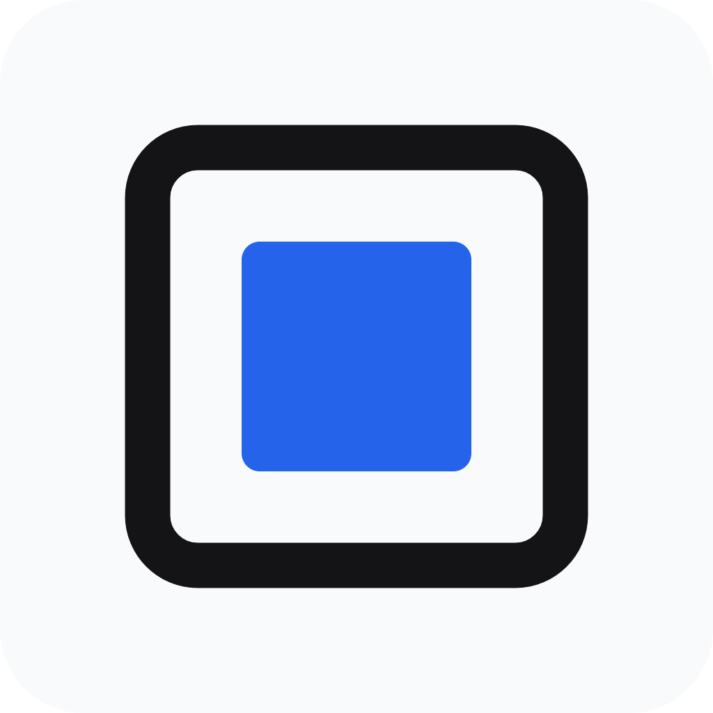

<p align="center">
  
</p>

<h1 align="center">Porder</h1>

<p align="center">
  <b>Turn your photography into gallery-ready framed prints, film borders, and editorial stories.</b>
</p>

<p align="center">
  <a href="https://github.com/porderapp/releases/releases/latest/download/porder-android.apk">Android APK</a> ·
  <a href="https://github.com/porderapp/releases/releases/latest/download/porder-windows-x64.zip">Windows</a> ·
  <a href="https://github.com/porderapp/releases/releases/latest/download/porder-linux-x64.tar.gz">Linux</a> ·
  <a href="https://porder.io.vn">Website</a>
</p>

---

Porder is a photo framing studio for Android and desktop. Drop in a photo and it
reads the EXIF — camera, lens, focal length, aperture, shutter, ISO, date — then
lays it into a finished frame: gallery mats, film borders, Polaroid cards and
editorial side-by-side layouts, with your own typography, logo, watermark and
colors. Exports are print-ready, up to full resolution, and carry the original
camera metadata with them.

## Download

Every link below always points at the newest build. The files are replaced in
place on each release, so there is no version to hunt through.

| Platform | File | Needs |
| --- | --- | --- |
| **Android** | [`porder-android.apk`](https://github.com/porderapp/releases/releases/latest/download/porder-android.apk) | Android 7.0 or newer |
| **Windows** | [`porder-windows-x64.zip`](https://github.com/porderapp/releases/releases/latest/download/porder-windows-x64.zip) | Windows 10 or 11, 64-bit |
| **Linux** | [`porder-linux-x64.tar.gz`](https://github.com/porderapp/releases/releases/latest/download/porder-linux-x64.tar.gz) | 64-bit, GTK 3 and `libsecret` |

On Android, Porder is also on
[Google Play](https://play.google.com/store/apps/details?id=io.vn.dungxnd.porder).

SHA-256 checksums for every file are in the
[release notes](https://github.com/porderapp/releases/releases/latest).

## Install

### Android

1. Download `porder-android.apk`.
2. Open it. Android asks you to allow installs from this source the first time —
   allow it for your browser or file manager.
3. Install, then open Porder.

This is the standalone build, sold directly. It is the same app as the Play
build, but Pro does not carry between them: a Play purchase belongs to the Play
build, and this one unlocks with a licence key.

### Windows

1. Download `porder-windows-x64.zip` and extract it anywhere — the zip holds a
   single `Porder` folder.
2. Run `Porder.exe`.

The build carries no code-signing certificate, so SmartScreen may warn about an
unknown publisher the first time: **More info** → **Run anyway**.

### Linux

```bash
mkdir -p porder
tar -xzf porder-linux-x64.tar.gz -C porder
./porder/Porder
```

Needs GTK 3, which every desktop distribution ships, and `libsecret` so the Pro
licence survives a restart (`libsecret-1-0` on Debian/Ubuntu, `libsecret` on
Fedora). Without a keyring Porder still runs and still remembers the licence, in
a sealed local file instead.

## Free and Pro

Porder is free to use, with no watermark and no ads. Pro is a one-time purchase:

|  | Free | Pro |
| --- | --- | --- |
| Every template, every editing control | ✓ | ✓ |
| Export resolution | up to 2048 px on the long edge | full, original resolution |
| Custom presets | 1 | unlimited |
| Watermark on exports | none | none |
| Price | — | see [pricing](https://porder.io.vn/pricing) |

Buy Pro from inside the app on Windows, Linux or the standalone APK: the licence
key arrives by email and activates on one machine at a time. On Android the Play
build uses Play Billing instead.

## About this repository

- **Binaries only.** Porder's source is private; this repository exists so the
  download links above stay stable.
- **Only the newest build is kept.** Assets are overwritten on every release —
  there is no version history and no changelog here. What changed in a release
  is on the [website changelog](https://porder.io.vn/changelog).
- **Update check:** every release also carries
  [`latest.json`](https://github.com/porderapp/releases/releases/latest/download/latest.json)
  — `version`, `build`, `publishedAt`, the note text in the app's own
  release-note shape, and the download URLs. An in-app update check reads that
  one file; the release page above shows the same note.
- Builds are produced by [`release.yml`](.github/workflows/release.yml) from a
  tagged version of the source, signed with Porder's upload key.

## Support

- Website: https://porder.io.vn
- Email: [contact@porder.io.vn](mailto:contact@porder.io.vn)

## License

Porder is proprietary software. Copyright © 2026 DungxND. All rights reserved.
Installing and using it is covered by the [terms of use](https://porder.io.vn/terms);
open-source components keep their own licenses, attributed in-app under
About → Open Source Licenses.
